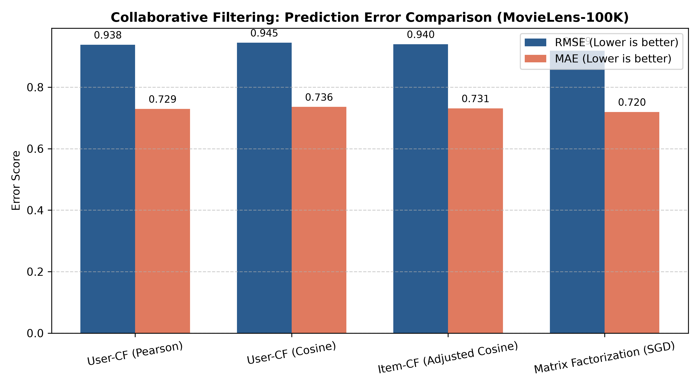
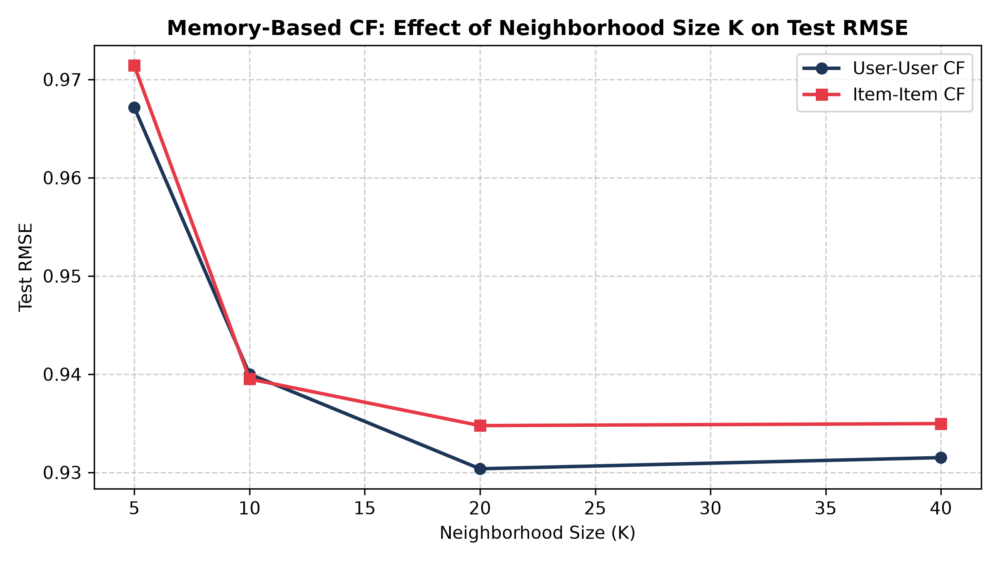
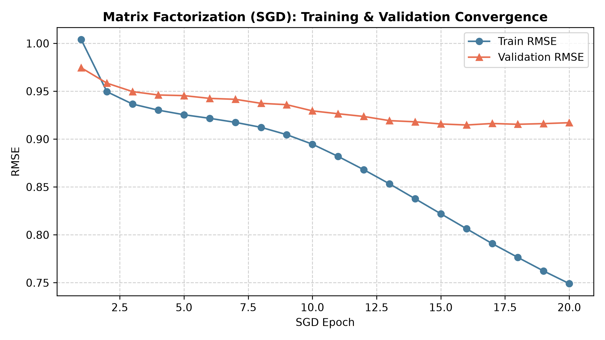

# Task 1: Collaborative Filtering

Imagine a group of friends swapping recommendations. If two people have behaved similarly in the past, one person's choices become a useful clue for the other. Collaborative filtering formalizes that social intuition using only the interaction history: users, items, and feedback.

## Objective

Build and compare two collaborative filtering approaches using the same interaction data and evaluation protocol:

- **A) Memory-based collaborative filtering:** compute user-user or item-item similarities directly from the interaction matrix and generate neighborhood-based recommendations.
- **B) Model-based collaborative filtering (matrix factorization):** learn compact user and item latent-factor vectors and use their interaction to predict preferences.

## Worked Example: User-Based Collaborative Filtering

Assume ratings out of 5 stars for four users and four movies: Alice rates *The Matrix*, *Inception*, and *Titanic* as 5, 4, and 1, but has not rated *Avatar*; Bob rates those movies 5, 5, and 1 and gives *Avatar* 4; Dave rates the first two 4 and 4 and gives *Avatar* 5; and Charlie's ratings are treated as opposite to Alice's. Using illustrative similarity scores of 0.9 for Bob, 0.8 for Dave, and -0.8 for Charlie, Bob and Dave become Alice's neighbors. The weighted prediction is $((0.9 \times 4) + (0.8 \times 5)) / (0.9 + 0.8) = 4.47$, so the system predicts approximately **4.5 stars** for *Avatar*. This traditional approach was important because it produced personalized recommendations from behavior alone; Amazon later documented a related **item-to-item** approach in its 2003 recommendation system, the basis for recommendations such as "Customers who bought this item also bought." The scores here are simplified for teaching, and the exact values depend on the similarity measure.

## Matrix Factorization Resource

For the model-based approach, see the [matrix factorization video tutorial](https://youtu.be/ZspR5PZemcs).

## Requirements

- Choose any relevant user-item interaction dataset suitable for implementing both collaborative filtering algorithms, and explain why it is appropriate. Task 01 does not require the supplied advertising dataset used by Tasks 02 and 03.
- Compare the memory based approach with the model-based approach using the same dataset and evaluation setup.
- Implement matrix factorization from scratch or with a clearly explained optimization procedure; do not use pretrained recommendation weights.
- Include a short results table, plots, and a conclusion explaining when the memory-based or model-based method is preferable.

## Deliverables

Submit one notebook or clean script covering both approaches, along with the preprocessing and split decisions, comparison plots, and metrics.

## Experimental Results & Visualizations

| Evaluation Metrics Comparison | Neighborhood Size Sensitivity (K) | Latent Factor Training Convergence |
| :---: | :---: | :---: |
|  |  |  |

### Performance Summary Table (MovieLens-100K)

| Model Architecture | Test RMSE (↓) | Test MAE (↓) | Precision@10 (↑) | Recall@10 (↑) | NDCG@10 (↑) | Inference Latency |
| :--- | :---: | :---: | :---: | :---: | :---: | :---: |
| **Memory-Based: User-CF (Pearson)** | 0.9382 | 0.7295 | 0.6638 | 0.9138 | 0.9248 | 0.62s |
| **Memory-Based: User-CF (Cosine)** | 0.9447 | 0.7359 | 0.6450 | 0.8940 | 0.9213 | 0.68s |
| **Memory-Based: Item-CF (Adj. Cosine)** | 0.9400 | 0.7313 | 0.6513 | 0.8988 | 0.9052 | 0.54s |
| **Model-Based: Matrix Factorization (SGD)** | **0.9188** | **0.7196** | 0.6513 | 0.9010 | 0.9186 | **0.16s** |

> **Single-File Execution:** All components (worked example, data processing, User-CF, Item-CF, SGD Matrix Factorization, K-tuning, and metric calculations) are contained in a single self-contained file: [`task_1_1.py`](task_1_1.py).
>
> ```powershell
> python task_1_1.py
> ```