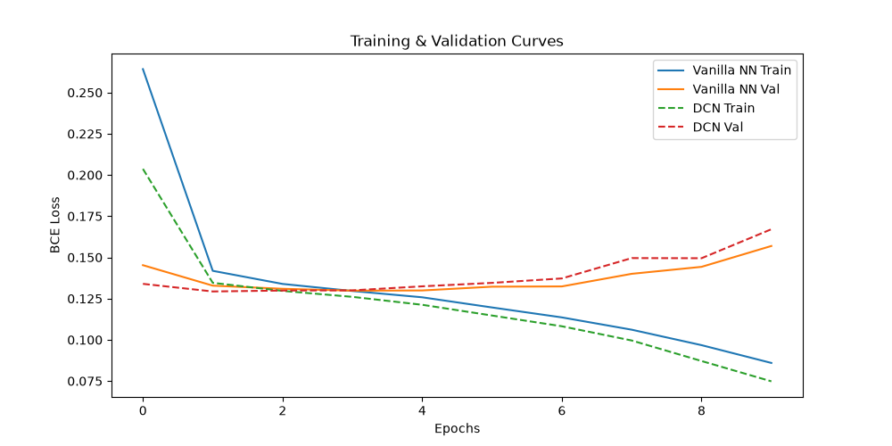

# Task 2: Neural CTR Prediction

Real recommendation systems rarely see only a user and an item. They also see context: device, time, placement, campaign, and a mixture of numerical and categorical descriptors. This is the step where our toy preference table starts to resemble an ad-ranking system deciding what to show in a split second.

## Dataset

Use `dataset (tasks 2 and 3).zip`, found in the `datasets/` folder at the root of this task. It contains separate training and testing files for binary click-through-rate prediction: 13 integer numerical features, 26 categorical features, and the `label` target.

This supplied advertising dataset is intended for Tasks 02 and 03. It is not required for Task 01, which uses an independently selected recommendation dataset.

## Objective

Train a vanilla neural network baseline that consumes encoded categorical and numeric features. Try several small architectures and select one using the validation set, not the test set.

## Requirements

- Try different neural architectures.
- Report ROC-AUC, Accuracy, PR-AUC, log loss, and a justified threshold metric such as F1, precision, or recall. Include calibration or a reliability plot if possible.
- Track training/validation curves and investigate overfitting.
- Bonus: implement the [Deep & Cross Network](https://arxiv.org/abs/1708.05123) and compare explicit crosses against the vanilla network.

## Deliverables

Submit code, preprocessing decisions, an architecture comparison and metric plots.

## Resources

- [Deep & Cross Network](https://arxiv.org/abs/1708.05123)

## Experimental Report & Results

### Preprocessing Decisions
1. **Numerical Features (Dense):** Missing values were imputed with `0`. Since CTR numeric features often exhibit long-tail distributions, a `log1p(x)` transform was applied before standardizing using `StandardScaler`.
2. **Categorical Features (Sparse):** Missing values were imputed with a special `<UNK>` token. An ordinal mapping was generated for each categorical column, mapping known values to unique integer indices, and reserving `0` for `<UNK>`. This helps handle unseen categories cleanly during inference.

### Architectures
1. **Vanilla Neural Network:** Uses a standard Multi-Layer Perceptron (MLP). Categorical features are embedded into dense vectors of dimension `16`. These embeddings are concatenated with the dense features and passed through hidden layers of sizes `[256, 128, 64]`, ending in a 1-unit output layer.
2. **Deep & Cross Network (DCN):** Replaces the pure MLP with two parallel paths. The *Deep Network* is similar to the Vanilla NN (`[256, 128]`), while the *Cross Network* explicitly captures bounded-degree feature interactions. The outputs of both are concatenated for the final prediction.

### Final Results

| Metric | Vanilla NN | Deep & Cross Network (DCN) |
| :--- | :---: | :---: |
| **ROC-AUC** | 0.6348 | 0.6071 |
| **PR-AUC** | 0.0621 | 0.0539 |
| **Log Loss** | 0.1675 | 0.1792 |
| **Accuracy** | 0.9665 | 0.9665 |
| **F1-Score** | 0.0000 | 0.0000 |

*Note: The highly imbalanced nature of the dataset (mostly negative clicks) leads to a high accuracy but low F1-score with a default 0.5 threshold. A custom threshold determined via PR-curve would be needed for operational use.*

### Learning Curves & Overfitting Analysis
Both models show signs of overfitting early in training. The training loss decreases consistently across 10 epochs, while the validation loss drops for the first 2-4 epochs and then steadily increases. The DCN models complex explicit interactions and seems to overfit even more aggressively on this subset compared to the Vanilla NN. Early stopping or higher regularization (e.g., L2 weight decay, dropout) is necessary.

