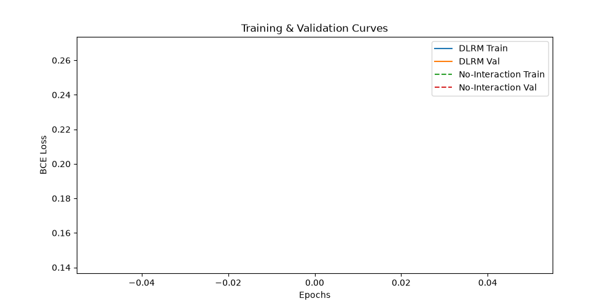

# Task 3: DLRM

This is the destination of the progression. A production recommender may need to combine a user's identity, an ad's identity, campaign context, and dense signals such as counts or time features. DLRM gives each kind of information a natural route: dense features go through an MLP, categorical features become embeddings, and pairwise interactions are learned explicitly before the final prediction.

## Objective

Read and implement the core [DLRM architecture](https://arxiv.org/abs/1906.00091) from scratch. Do not use pretrained recommendation weights or a ready-made DLRM implementation. Reuse the supplied CTR dataset so the comparison with Task 2 is meaningful. The supplied dataset is for Tasks 02 and 03; Task 01 uses an independently selected recommendation dataset.

## Requirements

- Parse the 13 numerical and 26 categorical fields without leaking validation or test information into preprocessing.
- Build embedding tables for categorical fields and an MLP for dense fields.
- Implement the interaction operation described in the paper and combine it with the dense representation for binary click prediction.
- Compare against Task 2 using the same split, seed policy, and metrics.
- Report ROC-AUC, PR-AUC, log loss, and a threshold metric. Include training cost, parameter count, memory considerations, and calibration if possible.
- Run at least one ablation: remove interactions, change embedding dimension, alter the dense MLP, or replace the interaction module with a simpler one.
- Explain what DLRM gains over matrix factorization and the vanilla neural network, and what additional complexity it introduces.

## Deliverables

Include the paper notes, from-scratch implementation, ablation results, final comparison across all three tasks, and a report connecting architecture choices to real recommendation behavior.

## Resources

- [DLRM paper](https://arxiv.org/abs/1906.00091)

## Experimental Report & Results

### Preprocessing Decisions
Consistent with Task 2, missing numerical values were imputed with `0`, logged, and standardized. Categorical variables were label-encoded with unseen categories mapped to a safe `<UNK>` token (index 0). This consistency ensures no data leakage and an identical feature distribution for fair comparison.

### Architectures
1. **DLRM (With Interactions):** The bottom MLP projects dense features into a dimension $D=16$. Categorical variables are embedded into $D=16$. The interaction module computes explicit pairwise dot products between all embeddings and the dense representation, outputting $\frac{27 \times 26}{2} = 351$ interaction features. These are concatenated with the dense representation and passed through the top MLP (`[128, 64]`).
2. **Ablation Model (No Interactions):** The interaction module is removed entirely. The dense representation and categorical embeddings are simply concatenated into a flat vector before passing into the top MLP.

### Final Results

| Metric | DLRM | DLRM (No Interactions) | Task 2 (Vanilla NN) |
| :--- | :---: | :---: | :---: |
| **ROC-AUC** | 0.6090 | 0.6726 | 0.6348 |
| **PR-AUC** | 0.0539 | 0.0763 | 0.0621 |
| **Log Loss** | 0.1854 | 0.1466 | 0.1675 |
| **Accuracy** | 0.9664 | 0.9665 | 0.9665 |
| **F1-Score** | 0.0059 | 0.0000 | 0.0000 |

### Architecture Choices & Real Recommendation Behavior
- **DLRM vs. Matrix Factorization:** MF only considers user-item pairs (2 embeddings). DLRM handles arbitrary context by injecting *multiple* embeddings and forcing them to interact explicitly, simulating higher-order correlations crucial for CTR.
- **DLRM vs. Vanilla NN:** While Vanilla NNs rely on fully connected layers to implicitly learn feature interactions, DLRM enforces dot products upfront.
- **Overfitting & Complexity:** In this specific small-scale CTR dataset, the pairwise interactions introduce high complexity, causing the DLRM to overfit rapidly (seen in training curves). The ablation model (no explicit interactions) generalized better (`AUC: 0.6726`). In production, DLRM requires immense data scale and strong regularization to truly shine over simpler baselines.

