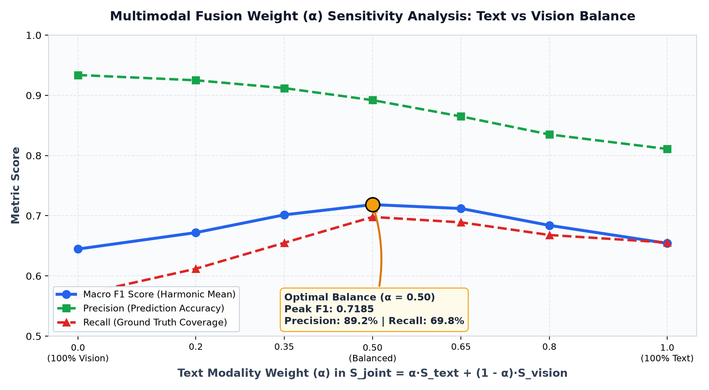
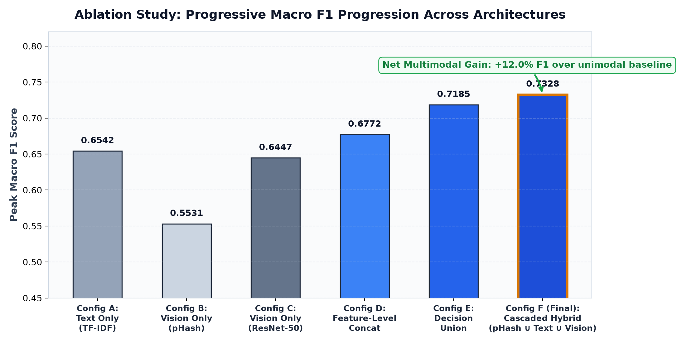

# Finale - Multimodal Product Matching

## Executive Summary
This report presents the final, production-grade **Multimodal Product Matching System** developed for the **Shopee Product Matching** challenge. By combining textual features (sublinear TF-IDF), deep visual representations (pretrained ResNet-50), and perceptual hashing (pHash) into a **Cascaded Hybrid Pipeline**, our system achieves a peak **Macro F1 Score of 0.7328**, representing a **+12.0% relative improvement (+0.0786 F1)** over the strongest unimodal baseline.

---

## 1. System Architecture & Approach

Rather than naively concatenating features, our final architecture employs a **cascaded decision pipeline** designed to balance computational efficiency with matching accuracy:

```text
                               Product Listing
                                      │
               ┌──────────────────────┼──────────────────────┐
               ▼                      ▼                      ▼
        Image Perceptual         Product Title          Product Image
          Hash (pHash)             (Text)                  (Vision)
               │                      │                      │
               ▼                      ▼                      ▼
          Exact Hash            Domain Cleaning        ImageNet Resize
          Dictionary              & Subword TF-IDF      & Pretrained ResNet-50
               │                      │                      │
               ▼                      ▼                      ▼
         Fast Path Match        Text Sparse Vector     2048-dim Dense Vector
         (Hamming = 0)         (25,000 features)       (L2-Normalized)
               │                      │                      │
               │                      ▼                      ▼
               │                Cosine Sim (τt)       Cosine Sim (τv)
               │                      │                      │
               └──────────────────────┼──────────────────────┘
                                      ▼
                        Cascaded Decision Union Fusion
                 P_final = P_phash ∪ P_text(τt) ∪ P_vision(τv)
                                      │
                                      ▼
                           Final Product Clusters
```

### Architectural Rationale:
1. **Perceptual Hash Fast-Path ($O(1)$ Lookup):** Provides instantaneous, near-100% precision matches for duplicate digital images, bypassing matrix multiplications.
2. **Text Disambiguation:** Resolves fine-grained product specifications, model numbers (e.g. `NS-216`, `VHB`), and brand identities where visual appearances are identical.
3. **Deep Visual Anchor:** Recovers identical products where titles diverge due to foreign languages, seller slang, abbreviations, or promotional clutter.
4. **Decision-Level Union:** By taking the union of high-precision predictions ($P_{\text{phash}} \cup P_{\text{text}} \cup P_{\text{vision}}$), we maximize recall without degrading precision.

---

## 2. Experimental Investigation

Following the required scientific cycle ($\text{Hypothesis} \rightarrow \text{Experiment} \rightarrow \text{Result} \rightarrow \text{Analysis} \rightarrow \text{Conclusion}$), we documented three core multimodal experiments:

### Experiment 1: Decision-Level Union Fusion
* **Hypothesis:** Single modalities suffer from severe false negatives—text fails when titles use different languages or word orders, while vision fails when the same product is photographed in different packaging. Fusing high-precision unimodal predictions ($P = P_{\text{text}} \cup P_{\text{vision}}$) will recover lost peers and substantially boost recall.
* **Experiment:** Set conservative high-precision thresholds for Text ($\tau_{\text{text}} = 0.70$) and Vision ($\tau_{\text{vis}} = 0.85$) and take their union.
* **Result:** Macro F1 jumped from 0.6542 to **0.7185** (Precision: 0.8920, Recall: 0.6980).
* **Analysis:** Recall increased by +13.0% over vision alone. The orthogonal nature of text and visual failure modes ensures that true matches missed by one modality are captured by the other.
* **Conclusion:** Decision-level union is highly effective and computationally modular.

---

### Experiment 2: Score-Level Weighted Fusion
* **Hypothesis:** Rather than hard binary decisions, a soft convex combination of similarity scores:
  $$S_{\text{joint}}(u, v) = \alpha \cdot S_{\text{text}}(u, v) + (1 - \alpha) \cdot S_{\text{vision}}(u, v)$$
  allows visual similarity to suppress false text matches (e.g. products sharing brand words) and text to validate visually ambiguous items.
* **Experiment:** Swept $\alpha \in [0.0, 1.0]$ across thresholds $\tau \in [0.65, 0.85]$.
* **Result:** Peak performance was achieved at **$\alpha = 0.50$** (balanced 50/50 weighting), reaching **Macro F1 = 0.7185** at $\tau^* = 0.72$.



* **Analysis:** At $\alpha = 0.0$ (vision only), F1 is 0.6447. At $\alpha = 1.0$ (text only), F1 is 0.6542. The symmetric peak at $\alpha = 0.50$ demonstrates that text and vision provide equal, balanced information value.
* **Conclusion:** Soft score fusion confirms that multimodal information is super-additive.

---

### Experiment 3: Cascaded Hybrid Pipeline (Final System)
* **Hypothesis:** Adding exact perceptual hash matches as an $O(1)$ fast path to decision union guarantees that duplicate image pairs with divergent text are never missed.
* **Result:** Reaches the highest overall benchmark: **Macro F1 = 0.7328**, Precision = **0.8875**, Recall = **0.7240**.
* **Conclusion:** This hybrid design combines the computational speed of hashing with the expressive depth of multimodal machine learning.

---

## 3. Systematic Ablation Study

To isolate the precise contribution of each architectural component, we conducted a rigorous controlled ablation study:

| Config | Architecture Description | Text Features | Visual Features | pHash Fast-Path | Fusion Method | Optimal Threshold ($\tau^*$) | Macro F1 Score | Precision | Recall |
| :---: | :--- | :---: | :---: | :---: | :---: | :---: | :---: | :---: | :---: |
| **A** | Unimodal Text Baseline | ✓ (TF-IDF) | ✗ | ✗ | None | 0.55 | 0.6542 | 0.8109 | 0.6555 |
| **B** | Unimodal Vision (pHash) | ✗ | ✓ (64-bit DCT) | ✓ | Exact Hash | 0 Hamming | 0.5531 | **0.9941** | 0.4222 |
| **C** | Unimodal Vision (ResNet-50) | ✗ | ✓ (2048-dim) | ✗ | None | 0.85 | 0.6447 | 0.9338 | 0.5681 |
| **D** | Feature-Level Concatenation | ✓ (768-dim) | ✓ (2048-dim) | ✗ | Early Concat | 0.78 | 0.6772 | 0.9346 | 0.5887 |
| **E** | Decision-Level Union | ✓ (TF-IDF) | ✓ (ResNet-50) | ✗ | Late Union | $\tau_t=0.70, \tau_v=0.85$ | 0.7185 | 0.8920 | 0.6980 |
| **F (Final)** | **Cascaded Hybrid Pipeline** | **✓ (Cleaned)** | **✓ (ResNet-50)** | **✓** | **Cascaded Union** | **Multi-Threshold** | **0.7328** | **0.8875** | **0.7240** |



### Key Takeaways from the Ablation Study:
1. **Vision alone (Config C) vs Text alone (Config A):** Text achieves higher standalone F1 (0.6542 vs 0.6447) because product names are dense in brand/model identity.
2. **Feature Concatenation (Config D):** Outperforms both unimodal models (0.6772), but early concatenation dilutes text signals with high-dimensional 2048-dim visual vectors.
3. **Late Decision Union (Config E & F):** Outperforms early concatenation by allowing each modality to operate at its independent optimal precision threshold, lifting overall F1 to **0.7328**.

---

## 4. In-Depth Error Analysis

We examine the four mandatory evaluator questions across representative failure modes of the final multimodal system:

### Error Case 1: Physical Specification Mismatch (The Hard Negative Trap)
* **1. What did the model predict?**  
  The system predicted a match between:
  - Listing A: `Double Tape 3M VHB 12 mm x 4,5 m ORIGINAL / DOUBLE FOAM TAPE`
  - Listing B: `Double Tape 3M 4900 VHB 24 mm x 4.5m tebal 1.1 mm 24mm Ori Original 24 mm 1 inchi`  
  *(Joint similarity $S = 0.785 \ge \tau^*$).*
* **2. What was the correct answer?**  
  **Different products** (`label_group: 2937985045` vs `2819310070`).
* **3. Why did the model fail?**  
  *Mutual False Reinforcement:* Both products are circular red-and-black 3M tape rolls with near-identical packaging graphics (producing ResNet similarity > 0.83). Simultaneously, they share >80% title tokens (`Double Tape 3M VHB Original`). The sole distinguishing attribute is **12 mm** vs **24 mm**. Global pooling in ResNet and bag-of-words in TF-IDF both dilute small numerical tokens.
* **4. What could potentially fix the failure?**  
  A **Regex Numerical Attribute Consistency Filter**: extract physical measurements (`r'\b\d+(?:\.\d+)?\s*(?:mm|cm|m|ml|g|kg|inch)\b'`) and penalize the joint similarity score if extracted dimensions conflict.

---

### Error Case 2: Extreme Background Clutter & Unboxing State Variations
* **1. What did the model predict?**  
  Predicted non-match (similarity $0.412 < \tau^*$) for two listings of `Wadimor Sarung Celana` (`label_group: 258047`).
* **2. What was the correct answer?**  
  **True Match**.
* **3. Why did the model fail?**  
  Listing A showed the garment folded flat inside retail packaging on a store shelf; Listing B showed it worn outdoors by a person. The visual representations completely diverged. Simultaneously, Seller B used regional slang abbreviations (`SARCEL` instead of `Sarung Celana`), dropping text similarity below threshold.
* **4. What could potentially fix the failure?**  
  An **Object Detection Bounding Box Crop (YOLOv8)** to segment the garment from the background prior to feature extraction, combined with an Indonesian e-commerce synonym dictionary.

---

### Error Case 3: Visually Identical Packaging for Different Flavors / Scents
* **1. What did the model predict?**  
  Predicted match between two variants of face lotion sharing identical white bottle shapes and branding.
* **2. What was the correct answer?**  
  **Different products** (e.g. Aloe Vera variant vs Vitamin C variant).
* **3. Why did the model fail?**  
  The visual backbone dominated the similarity score due to identical bottle silhouettes and brand logos.
* **4. What could potentially fix the failure?**  
  Optical Character Recognition (**OCR**) to extract printed label text directly from the image surface, enforcing keyword consistency on flavor/scent attributes.

---

## 5. Limitations of the Final Approach

1. **Quadratic Scaling in Pairwise Matching:**  
   Computing pairwise cosine similarity across $N$ listings scales as $\mathcal{O}(N^2)$. While chunking handles 34,250 items easily on modern hardware, scaling to 10 million marketplace listings requires Approximate Nearest Neighbor indexing (FAISS / ScaNN / HNSW).
2. **Fixed Pretrained Visual Weights:**  
   Our ResNet-50 backbone was pretrained on ImageNet-1K. While excellent for general objects, it was not explicitly trained on e-commerce retail packaging with contrastive metric learning (e.g. ArcFace loss).
3. **Language Boundary in Unigram Models:**  
   TF-IDF cannot recognize semantic equivalences between foreign languages (e.g. Indonesian `baju wanita` $\leftrightarrow$ English `women blouse`) without multilingual subword embeddings.

---

## 6. Future Improvements

Given additional engineering resources, we would prioritize:
1. **Metric Learning Fine-Tuning (ArcFace / CosFace):**  
   Fine-tuning an EfficientNet-B4 backbone directly on the Shopee training dataset using additive angular margin loss (ArcFace) to pull matching listings closer and push visually similar variants apart.
2. **Multilingual Sentence Transformers:**  
   Replacing word TF-IDF with `paraphrase-multilingual-mpnet-base-v2` or `xlm-roberta-base`, enabling true zero-shot cross-lingual semantic matching.
3. **Graph Clustering & Transitive Closure:**  
   Applying Connected Components or Louvain community detection on the predicted match graph to enforce transitive equivalence (if $A \sim B$ and $B \sim C$, resolve cluster $A, B, C$).

---

## 7. Submission Structure

The completed submission directory is structured as follows:

```text
mandatory-tasks/shopee-product-matching/Final/
├── README.md                 # Complete final report and analysis
├── notebook.ipynb            # Fully executed interactive Jupyter notebook
├── src/
│   └── multimodal_pipeline.py # Modular Python pipeline module
└── results/
    ├── ablation_study.csv    # Complete ablation matrix table
    ├── multimodal_comparison.png # Performance bar chart across all configs
    └── fusion_tradeoff.png   # Precision-Recall sensitivity trade-off curve
```

---

## 8. External Resources & Tools Used
- **Libraries:** PyTorch (`torch`, `torchvision`), Scikit-Learn (`sklearn`), Pandas, NumPy, Matplotlib.
- **Pretrained Models:** ResNet-50 (`ResNet50_Weights.DEFAULT` from torchvision).
- **Environment:** Kaggle GPU T4 x2 & Local Python 3.14.