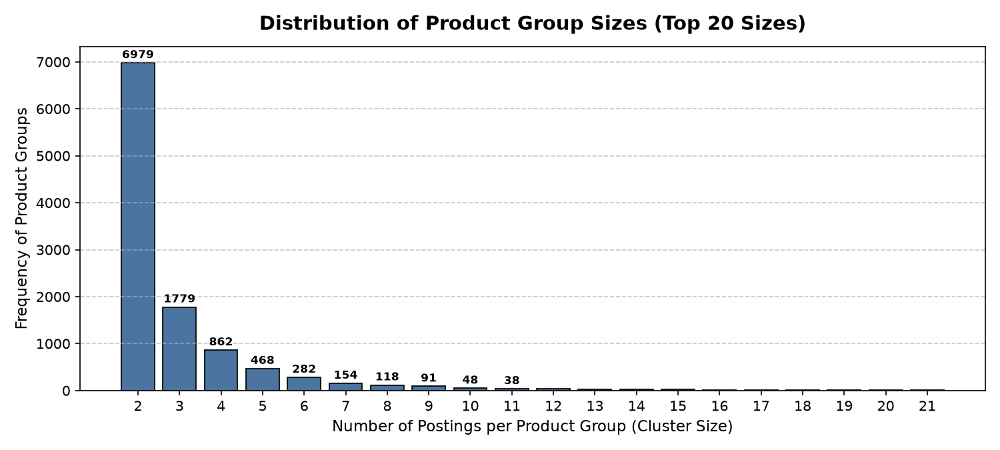
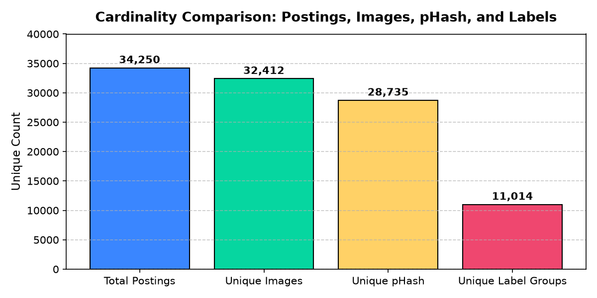
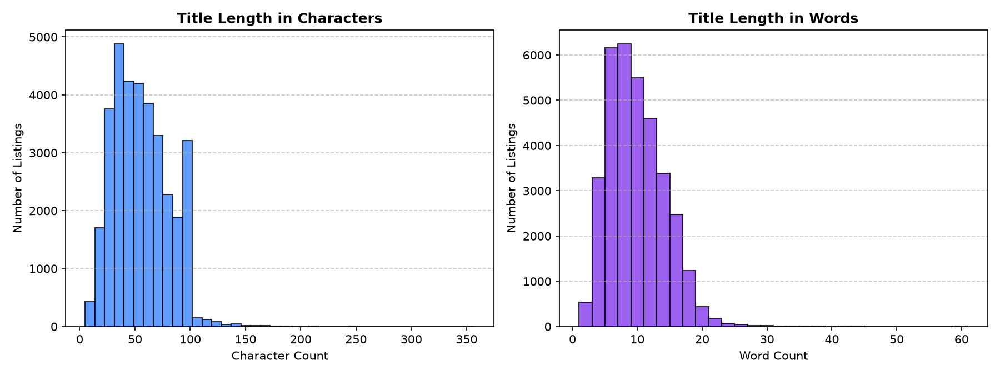
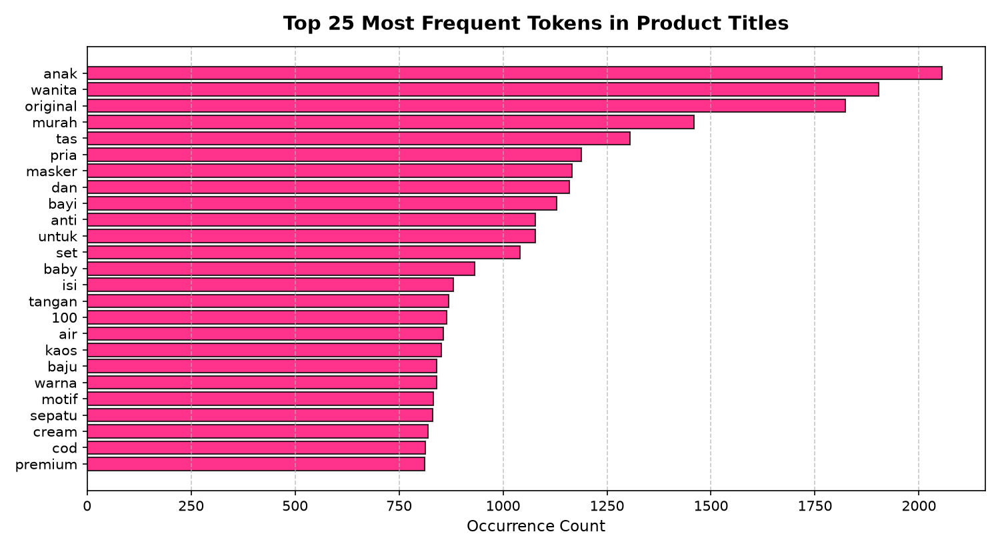

# Part A: Dataset Exploration & Problem Characterization

## Executive Summary
This report presents a comprehensive exploratory data analysis of the **Shopee Product Matching** dataset. The dataset comprises **34,250 product listings** across **11,014 unique product groups** (`label_group`). Product matching is cast as an entity resolution problem where the goal is to group listings corresponding to the exact same real-world stock-keeping unit (SKU).

---

## 1. Dataset Overview & Schema

| Column | Data Type | Null Count | Description |
| :--- | :--- | :--- | :--- |
| `posting_id` | String (`object`) | 0 (0.0%) | Unique identifier for each listing (e.g. `train_129225211`) |
| `image` | String (`object`) | 0 (0.0%) | Filename of the associated image in `train_images/` |
| `image_phash` | String (`object`) | 0 (0.0%) | 16-character hexadecimal 64-bit Perceptual Hash |
| `title` | String (`object`) | 0 (0.0%) | Raw product listing title submitted by the seller |
| `label_group` | Integer (`int64`) | 0 (0.0%) | Ground-truth integer ID representing the underlying product identity |

### Key Properties:
- **No Missing Values:** All 34,250 records are fully populated.
- **Transitive Equivalence:** If listing $A$ and listing $B$ share the same `label_group`, they represent the same underlying product. Every listing belongs to exactly one `label_group`.

---

## 2. Statistical Analysis of Product Groups

| Metric | Value |
| :--- | :--- |
| **Total Postings ($N$)** | 34,250 |
| **Unique Product Groups ($K$)** | 11,014 |
| **Minimum Group Size** | 2 |
| **Maximum Group Size** | 51 |
| **Mean Group Size** | 3.110 |
| **Median Group Size** | 2.0 |
| **Standard Deviation** | 2.853 |

### Group Size Quantiles:
- **25th Percentile:** 2
- **50th Percentile (Median):** 2
- **75th Percentile:** 3
- **90th Percentile:** 6
- **95th Percentile:** 9
- **99th Percentile:** 15

### Size Distribution Breakdown:
- **Size 2:** 6,979 groups (**63.36%**) — the vast majority of items have exactly 1 matching peer.
- **Size 3:** 1,779 groups (**16.15%**)
- **Size 4:** 862 groups (**7.83%**)
- **Size 5:** 468 groups (**4.25%**)
- **Size $\ge 6$:** 926 groups (**8.41%**)

> **Key Observation:** There are **zero singleton groups** in the training set (minimum size is 2). Every product listing has at least one other matching listing.

---

## 3. Visual Modality & Perceptual Hash (pHash) Analysis

Each image is accompanied by an `image_phash`, which fingerprints the image by calculating Discrete Cosine Transform (DCT) frequencies.

| Entity | Unique Count | Duplicate Entries |
| :--- | :--- | :--- |
| `posting_id` | 34,250 | 0 |
| `image` (filenames) | 32,412 | 1,838 duplicate image references |
| `image_phash` | 28,735 | 5,515 shared hash instances |
| `label_group` | 11,014 | — |

### The pHash Collision Finding:
- **147 distinct pHashes** map to **multiple different `label_group` IDs**.
- **Implication:** Perceptual hashing alone is not a sufficient deterministic classifier. Relying strictly on exact pHash equality will produce false positive merges for visually uniform products (e.g., solid color backgrounds, generic packaging, or stock logos).

---

## 4. Textual Modality: Title Length & Vocabulary Analysis

Titles are entered by independent third-party sellers across Southeast Asian markets (principally Indonesia and Malaysia).

### Length Distributions:
- **Character Count:** Min: 11, Max: 226, Mean: 53.76, Median: 52.0.
- **Word Count:** Min: 1, Max: 60, Mean: 9.81, Median: 9.0.

### Lexical Characteristics & Domain Noise:
- **Top Tokens:** `promo`, `ready`, `murah` (cheap), `baju` (clothes), `original`, `case`, `anak` (kids), `wanita` (women), `pria` (men), `dan` (and), `untuk` (for).
- **Seller Promotional Clutter:** Frequent prefix/suffix tags such as `[Bayar Di Tempat]` (Cash on delivery), `COD`, `100% Original`, `Termurah`, `Ready Stock`.
- **Multilingual Mixture:** Indonesian, Malay, and English words are frequently mixed within a single title (e.g. `Bros Pin Bentuk Kartun Kucing ... Chic Fashion Jewelry Bros`).

---

## 5. Product Similarity Traps & Edge Cases

### Case 1: Same Product Group with Lexical Invariance
- **Posting 1:** `Sarung celana wadimor original 100% dewasa dan anak hitam dan putih polos`
- **Posting 2:** `SARUNG CELANA WADIMOR DEWASA HITAM POLOS SARCEL`
- **Posting 3:** `WARNA RANDOM ACAK Sarung Celana Wadimor MURAH Celana Sarung WADIMOR`
- **Analysis:** All three belong to `label_group: 258047`. Seller 1 highlights authenticity and audience ("dewasa dan anak"), Seller 2 uses slang abbreviations ("SARCEL"), and Seller 3 swaps word order and adds promotional spam ("WARNA RANDOM ACAK ... MURAH"). Standard exact string matching fails, but TF-IDF and semantic embeddings capture the core SKU tokens (`sarung celana wadimor`).

### Case 2: Identical Title with Different `label_group` (False Positive Trap)
- Title: `ALAT CUKUR RAMBUT / KUMIS / JENGGOT NOVA NS-216`
- **Postings:** `train_3291363760` (Group: 4288078681) vs `train_2830351413` (Group: 2501975813)
- **Analysis:** Two listings share the exact same generic product title but are assigned distinct label groups due to differing bundled accessories, editions, or seller annotations. A pure text model with threshold 1.0 would falsely merge these.

### Case 3: pHash Collisions Across Different Products
- **Hash:** `d5780e316ed58786` maps to multiple distinct products.
- **Analysis:** Generic square packaging or flat solid backgrounds produce matching 64-bit DCT coefficients, proving that visual feature extractors require deep semantic embeddings (e.g. ResNet, EfficientNet, CLIP) rather than low-resolution perceptual hashing.

---

## 6. Synthesis of Identified Challenges

| Challenge Area | Description | Impact on Modeling |
| :--- | :--- | :--- |
| **1. Lexical Permutation & Noise** | Sellers insert promotional prefixes (`[COD]`, `PROMO`) and swap word orders. | Requires token normalization, sublinear TF scaling, and stopword filtering. |
| **2. Multilingual Vocabulary** | Mixture of Indonesian, English, and regional slang. | Subword tokenization (BPE/WordPiece) or character n-grams outperform strict word dictionaries. |
| **3. Subtle Specification Differences** | Products differ only by model number (e.g. Galaxy S20 vs S21) or volume (`50ml` vs `100ml`). | Global embeddings can accidentally group them; requires fine-grained attribute matching. |
| **4. Visual Background Clutter** | Products photographed in different lighting, angles, or against messy backgrounds. | Simple pixel distance or pHash fails; needs CNN/ViT models pretrained on object classification. |
| **5. Group Imbalance** | Group sizes vary from 2 to 51 (heavy-tailed distribution). | Precision vs. recall trade-offs become critical during thresholding. |

---

## 7. Answers to Evaluator Questions

### Q1: What makes two listings belong to the same product?
Two listings belong to the same product if they represent the **identical physical consumer item** (same manufacturer, model, specifications, and brand). In the dataset, this is represented by sharing the same `label_group` identifier.

### Q2: Can product titles alone reliably determine whether two listings match?
**No.** Titles suffer from both **false positives** (identical product names applied to different accessory bundles or variants) and **false negatives** (the same product described with completely different vocabulary, slang, or language translations).

### Q3: Can images alone reliably determine whether two listings match?
**No.** Perceptual hashes collide across distinct product groups (147 collision clusters). Furthermore, visually identical products may have different functional specifications (e.g., phone cases for different dimensions, identical-looking book covers with different editions).

### Q4: What types of examples are most difficult for ML models?
1. **Near-identical competitors:** Items from the same brand differing by a single model digit (e.g., iPhone 11 vs 12).
2. **Promotional overload:** Titles where 70% of words are spam words (`promo`, `murah`, `terlaris`, `bayar di tempat`).
3. **Low-resolution / cropped imagery:** User-uploaded smartphone photos with poor lighting and severe occlusions.

### Q5: What information in the dataset is most useful?
- The combination of **title text** (which carries exact brand names and model numbers) and **deep visual features** (which capture overall shape, color scheme, and aesthetic design).
- Text representations capture semantic and lexical similarity, while computer vision captures visual structure. Combining them in a **multimodal matching pipeline** resolves the ambiguities of both modalities.
