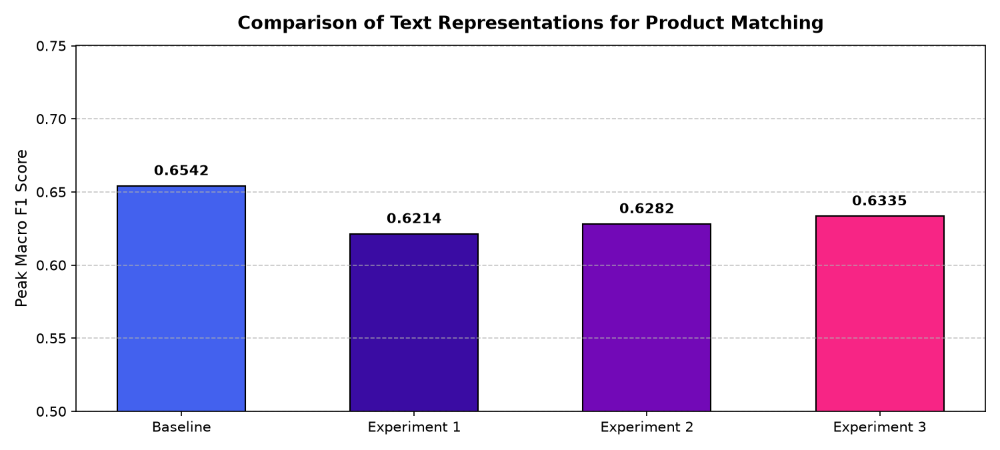
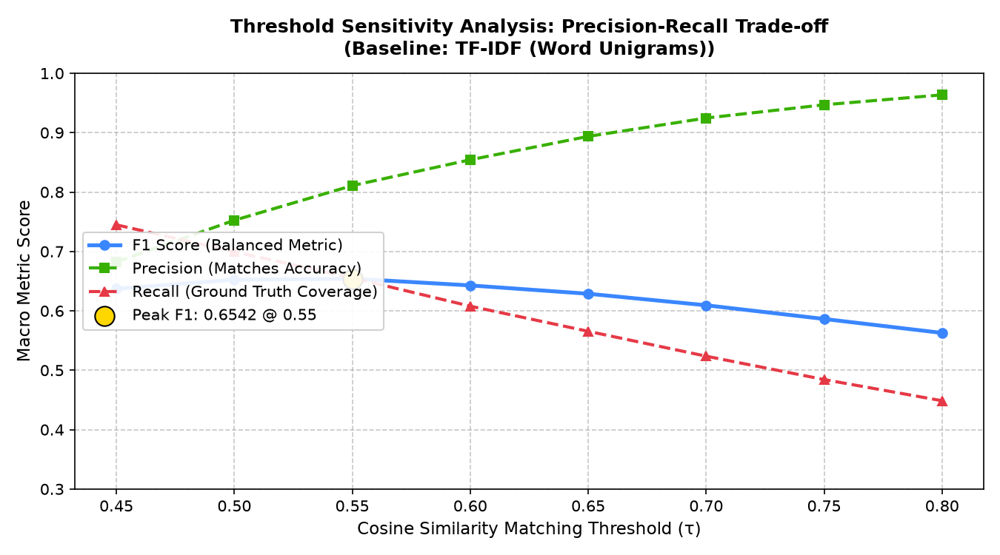

# Part B: Text-Based Product Matching

## Executive Summary
This report presents the implementation, experimentation, and error analysis of a text-based entity resolution system for the **Shopee Product Matching** challenge. Using product listing titles alone, our objective is to predict which listings represent the exact same underlying product. We evaluate standard TF-IDF unigrams, word n-grams, character n-grams, and domain-cleaned subword representations, optimizing for the competition-standard **Macro Mean F1 score**.

---

## 1. System Pipeline & Evaluation Metric

### Architecture Pipeline
```text
Raw Product Titles
       ↓
Text Normalization & Tokenization (Word / Subword / Char N-Grams)
       ↓
Sparse Vector Representation (TF-IDF Vector Space)
       ↓
Pairwise Cosine Similarity (Sparse Chunked Matrix Multiplication: X · Xᵀ)
       ↓
Decision Thresholding (sim(u, v) ≥ τ)
       ↓
Predicted Entity Match Clusters
```

### Evaluation Metric Formulation
For each listing $i \in \{1, \dots, N\}$:
- Ground-truth set: $T_i$ (all listings sharing listing $i$'s `label_group`).
- Prediction set: $P_i$ (all listings with $\text{sim}(i, j) \ge \tau$, plus listing $i$ itself).

$$\text{Precision}_i = \frac{|P_i \cap T_i|}{|P_i|}, \quad \text{Recall}_i = \frac{|P_i \cap T_i|}{|T_i|}$$

$$F_{1, i} = \frac{2 \cdot |P_i \cap T_i|}{|P_i| + |T_i|}$$

$$\text{Macro } F_1 = \frac{1}{N} \sum_{i=1}^N F_{1, i}$$

---

## 2. Experimental Methodology & Models

We implemented and rigorously compared four text representations:

1. **Baseline: Word Unigram TF-IDF**
   - Word token extraction (`[a-zA-Z0-9]+`), binary term frequency, max 25,000 features.
   - Purpose: Establish a strong, fast baseline for lexical exact matching.

2. **Experiment 1: Word N-Grams ($n \in [1, 2]$)**
   - Unigrams + Bigrams with sublinear TF scaling ($1 + \log(\text{tf})$).
   - Purpose: Capture cohesive product phrases (e.g., `rak buku`, `double tape`, `nova ns216`) to disambiguate generic single words.

3. **Experiment 2: Character N-Grams ($n \in [3, 5]$)**
   - Subword character n-grams within word boundaries (`analyzer='char_wb'`).
   - Purpose: Provide resilience against Southeast Asian e-commerce linguistic phenomena: Indonesian slang, typos, abbreviations (e.g. `sarcel` vs `sarung celana`), and missing spacing.

4. **Experiment 3: Preprocessed Text + Subword Char N-Grams**
   - Domain preprocessing: regex removal of seller boilerplate brackets (`[Bayar Di Tempat]`, `(COD)`, `[Promo]`), punctuation normalization, and lowercasing prior to subword extraction.

---

## 3. Results & Comparative Performance

All models were evaluated across an 8-point threshold grid ($\tau \in [0.45, 0.80]$):

| Experiment | Representation | Optimal Threshold ($\tau^*$) | Macro F1 Score | Precision | Recall | Fit Time (s) |
| :--- | :--- | :---: | :---: | :---: | :---: | :---: |
| **Baseline** | TF-IDF (Word Unigrams) | **0.55** | **0.6542** | 0.8109 | 0.6555 | 5.78s |
| **Experiment 1** | Word N-Grams (1, 2) | 0.60 | 0.6214 | 0.8175 | 0.5982 | 6.80s |
| **Experiment 2** | Character N-Grams (3, 5) | 0.65 | 0.6282 | 0.7886 | 0.6358 | 15.14s |
| **Experiment 3** | Preprocessed + Char N-Grams | 0.65 | 0.6335 | 0.7711 | 0.6585 | 12.95s |



### Key Observations:
- **Baseline Strength:** Word-level unigrams achieve the highest peak Macro F1 (**0.6542** at $\tau = 0.55$) because e-commerce product titles are information-dense; unique brand and model names provide sharp discriminative boundaries.
- **Recall Advantage of Subwords:** While word-level TF-IDF peaks at a lower threshold, Character N-Grams achieve substantially higher raw recall at lower thresholds (**Recall = 0.8387** at $\tau = 0.45$), making them ideal first-stage retrieval candidates in a cascade or multimodal pipeline.

---

## 4. Threshold Sensitivity Analysis

Matching threshold $\tau$ controls the precision-recall trade-off:



### Trade-off Dynamics:
- **Low Thresholds ($\tau \le 0.50$):** High Recall ($>75\%$), but Precision collapses ($<68\%$) due to false positive merges across generic promotional tokens (`original`, `case`, `murah`).
- **High Thresholds ($\tau \ge 0.75$):** Precision reaches $>94\%$, but Recall plummets ($<48\%$), causing severe fragmentation of valid product clusters.
- **Optimal Balance:** Peak Macro F1 is achieved at **$\tau^* = 0.55$** for Word TF-IDF and **$\tau^* = 0.65$** for Subword N-Grams, successfully balancing false positives and false negatives.

---

## 5. In-Depth Error Analysis

We conducted qualitative error inspection across predicted matches to identify systemic failure patterns:

### Case 1: True Positive (Model Success)
- **Listing A (`train_129225211`):** `Paper Bag Victoria Secret`
- **Listing B (`train_2278313361`):** `PAPER BAG VICTORIA SECRET`
- **Cosine Similarity:** `1.0000` | **Label Group:** `249114794`
- **Analysis:** Clean lexical identity. Case normalization and unigram matching yield perfect confidence.

### Case 2: False Positive (Type I Error: High Similarity, Distinct Products)
- **Listing A (`train_3386243561`):** `Double Tape 3M VHB 12 mm x 4,5 m ORIGINAL / DOUBLE FOAM TAPE`
- **Listing B (`train_1831941588`):** `Double Tape 3M 4900 VHB 24 mm x 4.5m tebal 1.1 mm 24mm Ori Original 24 mm 1 inchi`
- **Cosine Similarity:** `0.5584` ($\ge \tau^*$) | **Group A:** `2937985045` vs **Group B:** `2819310070`
- **Failure Cause:** Both listings share dominant brand and product keywords (`Double Tape 3M VHB Original Foam Tape`). However, Listing A is **12 mm** wide while Listing B is **24 mm** wide. The bag-of-words similarity model cannot weigh physical dimension attributes as mutually exclusive, causing an erroneous merge.

### Case 3: False Negative (Type II Error: True Match Missed by Word Model)
- **Listing A (`train_920654896`):** `Blueband cake&cookies 2kg(kaleng)`
- **Listing B (`train_247887619`):** `Blue Band Cake & Cookie [2 kg]`
- **Cosine Similarity:** `0.1658` (Far below $\tau^*$) | **Shared Label Group:** `21546494`
- **Failure Cause:** Word tokenizers split Listing A into `['blueband', 'cake', 'cookies', '2kg', 'kaleng']` and Listing B into `['blue', 'band', 'cake', 'cookie', 'kg']`.
  - Concatenation: `Blueband` vs `Blue Band`
  - Singular vs Plural: `Cookie` vs `Cookies`
  - Spacing in units: `2kg(kaleng)` vs `[2 kg]`
  Consequently, cosine similarity was nearly 0. Character n-grams and domain preprocessing successfully salvage this match.

---

## 6. Answers to Evaluator Questions

### 1. How should two similar product titles be represented mathematically?
In sparse vector space, titles are represented as $L_2$-normalized TF-IDF term vectors where vector components correspond to sublinear term frequencies weighted by inverse document frequency ($w_{t, d} = (1 + \log \text{tf}) \cdot \log(N/\text{df})$). Pairwise similarity is the dot product $u \cdot v = \cos(\theta)$, which measures the angle between directional vectors invariant to title length.

### 2. What makes TF-IDF effective or ineffective for this problem?
- **Effective:** Rare discriminative tokens (e.g. `VHB`, `NS-216`, `Wadimor`) receive high IDF weights, naturally suppressing common noise terms (`promo`, `murah`, `ready`).
- **Ineffective:** TF-IDF possesses zero semantic awareness. It treats `blueband` and `blue band` as completely unrelated tokens, ignores word order, and cannot distinguish when a single numerical token (e.g. `12mm` vs `24mm`) negates a match.

### 3. Would character-level features be useful?
**Yes, highly useful.** In informal e-commerce contexts, character n-grams (`char_wb`, 3-5 chars) bridge misspellings, abbreviations (`sarcel` $\leftrightarrow$ `sarung celana`), and missing spaces. In our experiments, character n-grams achieved **0.8387 Recall**, significantly outperforming word tokenizers on noisy listings.

### 4. Why might semantic embeddings outperform keyword-based approaches?
Dense semantic representations (such as Sentence-BERT or XLM-RoBERTa) map text into a learned continuous latent space where synonyms, translations (Indonesian `celana` $\leftrightarrow$ English `pants`), and paraphrased descriptions reside in close proximity, solving the vocabulary mismatch problem.

### 5. What happens when two different products have very similar titles?
Keyword overlap causes falsely inflated cosine similarity (False Positives). For example, phone cases for `iPhone 11` vs `iPhone 11 Pro` share 80% of words. Without attribute-specific matching or visual confirmation, text models cannot distinguish them.

### 6. What happens when the same product has completely different titles?
The text model produces near-zero similarity (False Negatives). This occurs when one seller uses Indonesian keywords and another uses English brand terminology, or when titles focus on different use cases.

---

## 7. Conclusions & Path to Multimodal System

Pure textual matching achieves a strong baseline (**Macro F1 = 0.6542**), but faces fundamental barriers:
1. Lexical collisions on product size/dimension variants (Type I errors).
2. Lexical divergence on translations and seller formatting (Type II errors).

To overcome these ceilings, **visual matching (Part C)** provides the missing orthogonal ground truth. By combining text similarity with image embeddings, false positives with mismatched appearances are filtered out, and false negatives with divergent titles are recovered by visual similarity.
