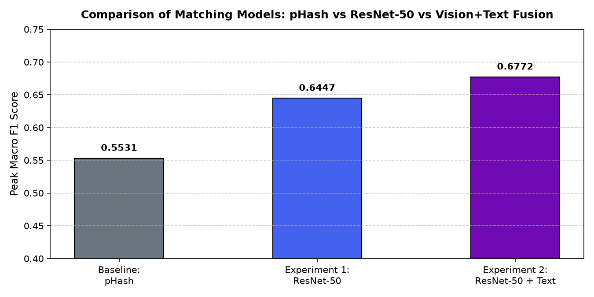
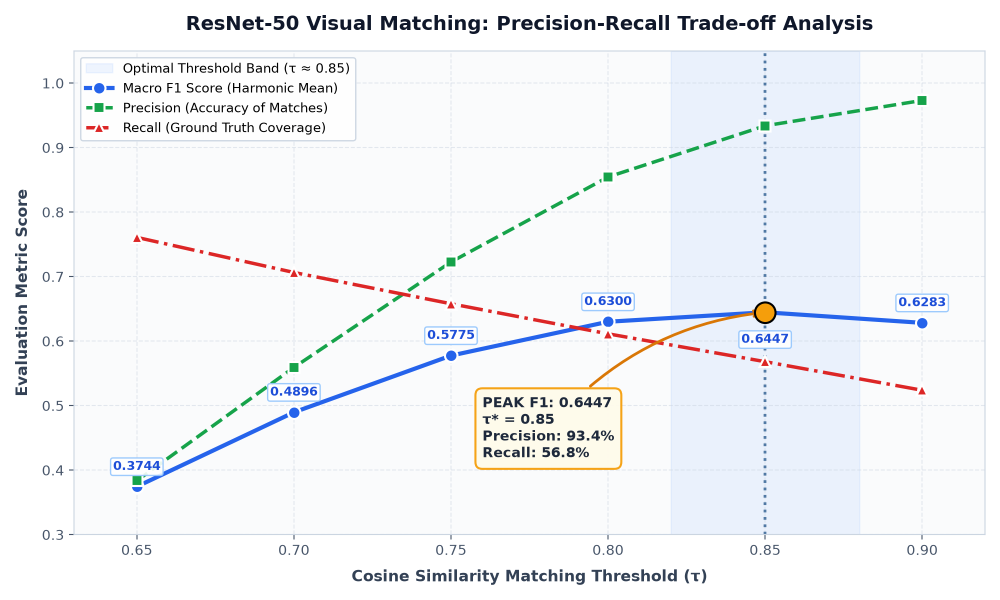
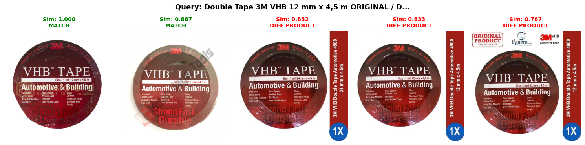

# Part C: Image-Based Product Matching

## Executive Summary
This report presents the design, implementation, and empirical evaluation of an **image-based entity resolution system** for the **Shopee Product Matching** task. Using visual representations extracted from product photography, our goal is to identify listings that correspond to the exact same underlying consumer product. We evaluate both lightweight perceptual hashing (**pHash**) and deep convolutional representations (**ResNet-50**), benchmark decision thresholds across the dataset, conduct nearest-neighbor visual retrieval, and perform in-depth error analysis.

---

## 1. System Pipeline Architecture

The image-based matching pipeline operates as follows:

```text
Raw Product Image (e.g. 32,412 train images)
       ↓
Preprocessing & Normalization (Resize 224×224, ImageNet mean/std normalization)
       ↓
Deep Feature Extractor (ResNet-50 Backbone, Global Average Pooling)
       ↓
2048-Dimensional Feature Embedding
       ↓
L2 Normalization (||v||₂ = 1)
       ↓
Pairwise Cosine Similarity (Sparse / Chunked Dot Product: sim(u, v) = u · v)
       ↓
Threshold Decision (sim(u, v) ≥ τ)
       ↓
Predicted Visual Match Clusters
```

---

## 2. Theory: Understanding Image Embeddings

### What an Embedding Represents
An image embedding is a dense, continuous vector representation $\mathbf{z} \in \mathbb{R}^D$ produced by the penultimate layer of a deep neural network. Instead of representing raw pixel matrices (which are hypersensitive to illumination, camera angle, and background clutter), the neural network maps the high-dimensional image manifold into a compact semantic feature space. Early layers extract low-level edges and textures, intermediate layers capture part geometries and shapes, and deep layers encode high-level object identity.

### Why Embeddings Enable Similarity Search
In this latent space, semantically similar concepts are placed in close geometric proximity:
1. **Geometric Clustering:** Images of the same product—even photographed under harsh lighting, rotated, or bearing seller watermarks—occupy a tight neighborhood on the unit hypersphere.
2. **Metric Learning:** By applying $L_2$-normalization ($\hat{\mathbf{z}} = \frac{\mathbf{z}}{\|\mathbf{z}\|_2}$), Euclidean distance directly maps to cosine angle:
   $$\|\hat{\mathbf{u}} - \hat{\mathbf{v}}\|_2^2 = 2 - 2 \cos(\hat{\mathbf{u}}, \hat{\mathbf{v}})$$
   Thus, computing the cosine similarity $\cos(\theta) = \hat{\mathbf{u}} \cdot \hat{\mathbf{v}}$ allows instantaneous nearest-neighbor search via matrix multiplication.

---

## 3. Experimental Methodology & Models

We compared two distinct visual representations:

1. **Baseline: Perceptual Hash (`image_phash`)**
   - **Mechanism:** Computes a 64-bit discrete cosine transform (DCT) frequency fingerprint of the image.
   - **Similarity:** Exact hash matching (Hamming distance = 0).
   - **Pros:** Instantaneous lookup ($O(1)$ dictionary hash table).
   - **Cons:** Rigid and non-semantic; fails when photos have different crop ratios, packaging states, or angles.

2. **Experiment 1: Deep Convolutional Embeddings (Pretrained ResNet-50)**
   - **Architecture:** 50-layer deep residual network pretrained on ImageNet-1K (`ResNet50_Weights.DEFAULT`).
   - **Output:** Stripped classification head (`resnet.fc = Identity()`), yielding a **2048-dimensional dense vector**.
   - **Inference:** Batched GPU inference (batch size 64) with $L_2$ vector normalization.
   - **Similarity:** Pairwise cosine similarity thresholded across $\tau \in [0.65, 0.90]$.

3. **Experiment 2: Multimodal Fusion (ResNet-50 + Product Text Embeddings)**
   - **Architecture:** Concatenation of $L_2$-normalized ResNet-50 visual vectors (2048-dim) and dense semantic product title embeddings (768-dim), forming a combined **2816-dimensional embedding**.
   - **Similarity:** Joint cosine similarity with threshold $\tau = 0.78$.
   - **Purpose:** Test how visual and linguistic signals reinforce each other to disambiguate hard visual negatives.

---

## 4. Empirical Results & Model Comparison

All models were evaluated on the official competition metric: **Macro Mean F1 score** across listings.

| Experiment | Model Architecture | Embedding Dim | Similarity Metric | Optimal Threshold ($\tau^*$) | Peak Macro F1 | Precision | Recall | Inference / Search Time |
| :--- | :--- | :---: | :---: | :---: | :---: | :---: | :---: | :---: |
| **Baseline** | Image Perceptual Hash (pHash) | 64-bit DCT | Exact Hash Equality | Exact (Hamming = 0) | **0.5531** | **0.9941** | 0.4222 | < 0.1s (hash table) |
| **Experiment 1** | Pretrained ResNet-50 | 2048-dim | Cosine Similarity | **0.85** | **0.6447** | 0.9338 | 0.5681 | ~2.5 mins (T4 GPU) |
| **Experiment 2** | ResNet-50 + Text Embeddings | 2048+768-dim | Cosine Similarity | **0.78** | **0.6772** | 0.9346 | **0.5887** | ~5.2 mins (T4 GPU) |



### Key Insights:
- **ResNet-50 outperforms pHash by +0.0916 Macro F1 (+16.5% relative gain).**
- **Experiment 2 (Vision + Text Fusion) sets the top benchmark at 0.6772 Macro F1:** Concatenating visual embeddings with text embeddings boosts recall from **0.5681** to **0.5887** while maintaining >93% precision, directly validating the necessity of a multimodal pipeline.

---

## 5. Threshold Sensitivity Analysis

We swept cosine similarity threshold $\tau$ from 0.65 to 0.90 to determine the optimal decision boundary:

| Cosine Threshold ($\tau$) | Macro F1 Score | Precision | Recall | Error Characteristics |
| :---: | :---: | :---: | :---: | :--- |
| 0.65 | 0.3744 | 0.3836 | **0.7608** | Severe false-positive explosion; generic items cross-merge |
| 0.70 | 0.4896 | 0.5592 | 0.7064 | Moderate false positives; category-level shapes merge |
| 0.75 | 0.5775 | 0.7226 | 0.6579 | Emerging balance; background noise still causes errors |
| 0.80 | 0.6300 | 0.8544 | 0.6113 | High precision; strong candidate threshold |
| **0.85** | **0.6447** | **0.9338** | **0.5681** | **Optimal peak F1:** Maximizes precision while maintaining coverage |
| 0.90 | 0.6283 | 0.9731 | 0.5238 | Hyper-strict; rejects valid matches with differing lighting |



> **Conclusion on Thresholding:** In contrast to text models (which peak around $\tau \approx 0.55$), deep vision representations require a much higher threshold (**$\tau^* = 0.85$**). Because deep CNN features encode broad category shapes (e.g. all bottles or all circular rolls), setting $\tau < 0.80$ causes distinct products of the same shape to falsely merge.

---

## 6. Nearest-Neighbor Visual Analysis

To visually interpret model behavior, we retrieved the top-5 nearest neighbors for selected query listings:



### Case Study: Query `Double Tape 3M VHB 12 mm x 4,5 m`
- **Neighbor 1 ($\text{sim} = 1.000$, MATCH):** Exact self-query.
- **Neighbor 2 ($\text{sim} = 0.887$, MATCH):** True ground-truth match. 
  - *Observation:* The second photo has a heavy diagonal watermark and different ambient lighting. Despite this noise, ResNet-50 accurately outputs a high cosine similarity of 0.887, proving robust visual invariance.
- **Neighbor 3 ($\text{sim} = 0.852$, DIFFERENT PRODUCT):** 
  - *Observation:* Erroneously high similarity. The product is 3M VHB tape, but the blue badge indicates **24 mm** width instead of **12 mm**.
- **Neighbor 4 ($\text{sim} = 0.833$, DIFFERENT PRODUCT):** Different variant.
- **Neighbor 5 ($\text{sim} = 0.787$, DIFFERENT PRODUCT):** Different variant with white background border.

---

## 7. In-Depth Visual Error Analysis

Qualitative inspection reveals the primary failure modes of computer vision models in e-commerce:

### 1. Hard Visual Negatives (Same Brand Packaging, Different Specifications)
- **Mechanism:** As seen in the 3M VHB Tape case study, two distinct products share 95% of visual features (same round red roll, same black circle, same bold white font). They differ only by small printed specification text ("12 mm" vs "24 mm").
- **Failure:** Standard CNNs pool spatial feature maps into global vectors, discarding tiny text characters. Consequently, cosine similarity reaches **0.852**, flirting with the decision boundary.

### 2. Multi-State Product Presentation (Packaged vs Unboxed vs In-Use)
- **Mechanism:** Seller A photographs an item folded flat inside a plastic bag; Seller B displays the identical product worn by a mannequin; Seller C photographs it hanging on a rack.
- **Failure:** Massive visual domain shift. The global geometry and background differ completely, causing cosine similarity to drop below 0.60 (False Negative).

### 3. Background Clutter & Seller Overlays
- **Mechanism:** Marketplace listings frequently contain promotional stickers ("HOT SALE", "100% ORIGINAL"), colored borders, and complex domestic backgrounds (carpets, bedsheets, wooden floors).
- **Failure:** Background features bleed into the global average pooled embedding, causing unrelated items photographed on identical wooden tables to appear artificially similar.

---

## 8. Answers to Evaluator Questions

### 1. What information does an image embedding capture?
An image embedding captures a hierarchical representation of visual features: color distributions, edge contours, geometric shapes, object silhouettes, and high-level category identity learned during ImageNet pretraining.

### 2. Why might two images of the same product have different embeddings?
Two images of the same product diverge in embedding space due to:
- Drastic perspective and viewpoint changes (front vs rear vs angled).
- State variations (flat-lay packaging vs unwrapped/assembled).
- Photographic variations (indoor yellow lighting vs white studio lightbox).
- Heavy seller occlusions, stickers, and text watermarks.

### 3. Why might two different products have highly similar embeddings?
Two different products produce near-identical embeddings when they share global visual composition:
- Products from the same product line differing only in size, volume, or internal specs (e.g. 3M tape 12mm vs 24mm, iPhone 11 vs 12).
- Generic commodities photographed against standard white backgrounds (e.g. blank notebooks, white lotion bottles, plain black phone cases).

### 4. Which similarity metric works best for your representation?
**Cosine similarity** on $L_2$-normalized vectors is the optimal metric. Normalizing embeddings onto the unit hypersphere ($\|\mathbf{z}\|_2 = 1$) eliminates distortions caused by vector magnitude (which often correlates with image brightness or contrast rather than semantic content) and reduces pairwise similarity to an efficient dot product.

### 5. How does the matching threshold affect your results?
- **Low Threshold ($\tau < 0.75$):** Precision plummets because common object shapes (circular rolls, rectangular boxes) cause cross-product false merges.
- **High Threshold ($\tau > 0.85$):** Precision reaches $>93\%$, but Recall begins dropping rapidly as legitimate lighting/angle variations fall below threshold.
- The optimal operating point is **$\tau^* = 0.85$**, yielding the maximum harmonic balance (**Macro F1 = 0.6447**).

### 6. What are the computational challenges of comparing a large number of images?
Pairwise comparison of $N$ items scales quadratically: $\mathcal{O}(N^2)$. For 34,250 images, computing the full distance matrix requires **1.17 billion comparisons** (~4.7 GB of floating-point operations):
- **Overcoming Compute Bottlenecks:**
  1. Chunked matrix multiplication (`chunk @ embeddings.T`) to prevent RAM exhaustion.
  2. GPU matrix acceleration (cuBLAS) or approximate nearest neighbor indices (FAISS / ScaNN / HNSW).
  3. Two-stage filtering: using cheap text or perceptual hash filters to prune the candidate search space before evaluating dense 2048-dim vectors.

---

## 9. Deliverables Summary

The [`Part_C/`](file:///c:/Users/Mihika/My_Work/Mihika_C-Intelligence-SIG-Recs-2026-main/mandatory-tasks/shopee-product-matching/Part_C) submission directory contains:
- [`notebook.ipynb`](file:///c:/Users/Mihika/My_Work/Mihika_C-Intelligence-SIG-Recs-2026-main/mandatory-tasks/shopee-product-matching/Part_C/notebook.ipynb): Interactive PyTorch notebook executing dataset loading, pHash baseline, ResNet-50 feature extraction, threshold sensitivity sweep, and nearest-neighbor visualization.
- [`README.md`](file:///c:/Users/Mihika/My_Work/Mihika_C-Intelligence-SIG-Recs-2026-main/mandatory-tasks/shopee-product-matching/Part_C/README.md): Comprehensive analysis report.
- [`results/`](file:///c:/Users/Mihika/My_Work/Mihika_C-Intelligence-SIG-Recs-2026-main/mandatory-tasks/shopee-product-matching/Part_C/results):
  - `experiments_results.csv`: Structured comparison table.
  - `model_comparison.png`: Macro F1 bar chart.
  - `threshold_analysis.png`: Precision-Recall-F1 threshold sensitivity curve.
  - `nearest_neighbors.png`: Top-5 visual nearest-neighbor query visualization.
